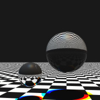

## Description


This projects is an implementation of Whitted raytracing algorithm for 3D graphics. The code was inspired by [this site](https://www.scratchapixel.com/).
This program can be compiled make with makefile. Used compiler - GCC.
```
make run
```

## Implementation
In this program implemented:
- Multiple light source color lighting
- Specular and diffuse lighting
- Reflection
- Refraction and Fernel coefficient
- Anti-aliasing

Implemented objects:
- Sphere
- Plane

Implemented light sources:
- Dot light
- Spot light
- Direct light

The program will generate PPM file with picture. By now parameters can be configured through code.

## Dependencies
It uses ncurses library.
